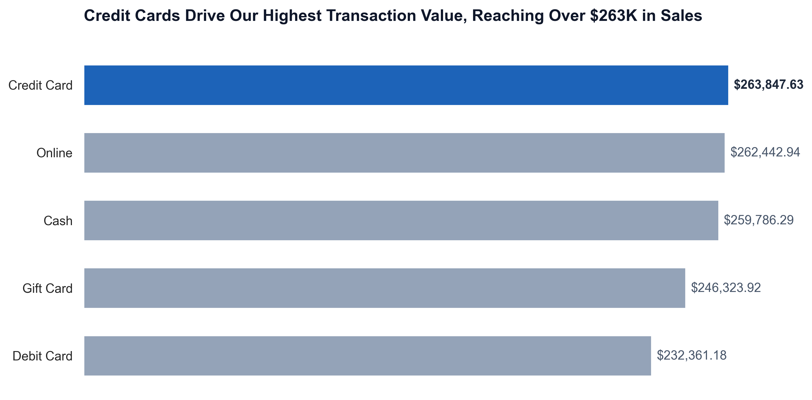
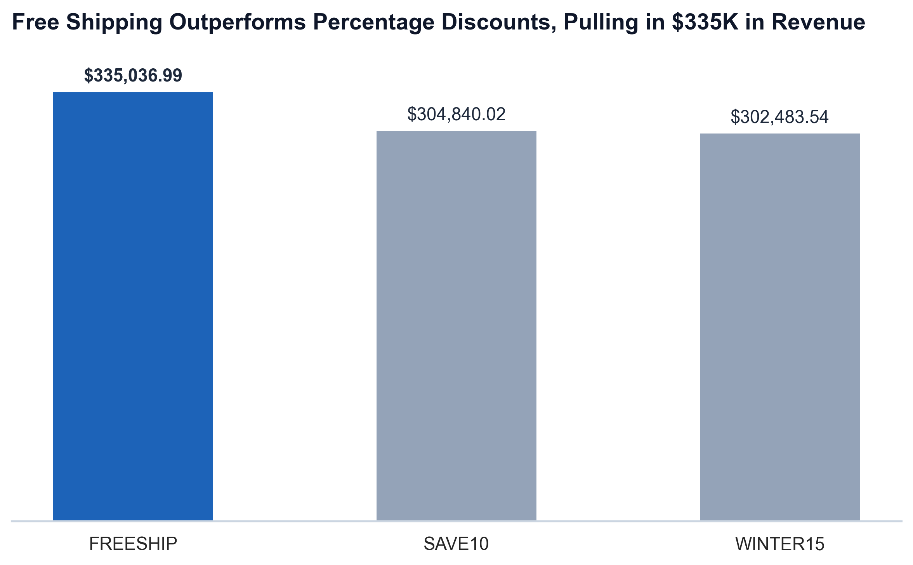
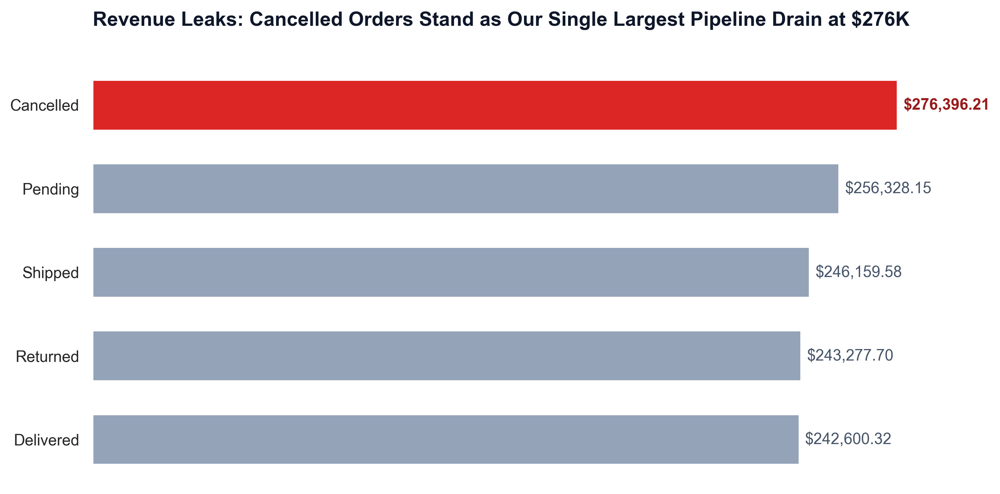

# Decodelabs Internship
Data Analysis Internship Project. Project 1 to Final Evaluation.
## Project 1 - Data Cleaning

### 📋 Data Dictionary & Schema

The dataset contains **1,200 rows** and **14 columns**. The detailed breakdown of the schema, including data descriptions, non-null counts, and optimized data types.

| # | Column Name | Non-Null Count | Raw Type | Corrected Type | Description |
|---|:---|:---:|:---:|:---:|:---|
| 0 | **OrderID** | 1,200 | `str` | `str` | Unique alphanumeric identifier for each transaction. |
| 1 | **Date** | 1,200 | `str` | `datetime64[ns]` | Date and time when the order was placed. |
| 2 | **CustomerID** | 1,200 | `str` | `str` | Unique identifier assigned to each customer. |
| 3 | **Product** | 1,200 | `str` | `str` / `object` | Name or identifier of the specific item purchased. |
| 4 | **Quantity** | 1,200 | `int64` | `int64` | The number of units purchased for this specific item. |
| 5 | **UnitPrice** | 1,200 | `float64` | `float64` | Price of a single unit of the product. |
| 6 | **ShippingAddress** | 1,200 | `str` | `str` / `object` | Recipient's destination delivery address. |
| 7 | **PaymentMethod** | 1,200 | `str` | `category` | Payment option used by the customer (e.g., Credit Card, PayPal). |
| 8 | **OrderStatus** | 1,200 | `str` | `category` | The current stage of the purchase fulfillment (e.g., Shipped, Pending, Cancelled). |
| 9 | **TrackingNumber** | 1,200 | `str` | `str` / `object` | Identifier used to monitor the shipping status of the order. |
| 10 | **ItemsInCart** | 1,200 | `int64` | `int64` | Total count of all items the shopper had in their digital shopping cart. |
| 11 | **CouponCode** | 891 | `str` | `str` (filled) | Unique promotional code used to apply a discount (contains 309 missing values where no coupon was used). |
| 12 | **ReferralSource** | 1,200 | `str` | `category` | The channel or medium through which the customer discovered the business. |
| 13 | **TotalPrice** | 1,200 | `float64` | `float64` | The final total amount paid by the customer after discounts and quantities are applied. |

> **Note on Missing Data:** The `CouponCode` column has **309 missing values** (representing ~25.8% of the dataset). This indicates that a discount code was not used for those transactions. However, these have been filled with `"No coupon"` during the data cleaning process.

### Dataset Descriptive Statistics Summary

| Metric | Date | Quantity | UnitPrice | ItemsInCart | TotalPrice |
| :--- | :--- | :---: | :---: | :---: | :---: |
| **Count** | 1,200 | 1,200 | 1,200 | 1,200 | 1,200 |
| **Mean (Average)** | 2024-03-22 16:58:48 | 2.95 | $356.41 | 5.49 | $1,053.97 |
| **Standard Deviation** | *N/A* | 1.41 | $197.18 | 2.28 | $819.86 |
| **Minimum** | 2023-01-01 00:00:00 | 1.00 | $11.39 | 1.00 | $11.39 |
| **25% (Q1)** | 2023-08-03 18:00:00 | 2.00 | $186.06 | 4.00 | $410.52 |
| **50% (Median)** | 2024-03-23 00:00:00 | 3.00 | $364.21 | 5.00 | $823.62 |
| **75% (Q3)** | 2024-11-08 12:00:00 | 4.00 | $521.57 | 7.00 | $1,578.48 |
| **Maximum** | 2025-06-30 00:00:00 | 5.00 | $699.93 | 10.00 | $3,456.40 |

#### Breakdown of Summary Statistics

1. **Date (Timeline & Scope)**
- The Range: The data starts on January 1, 2023 and ends on June 30, 2025.
- The Distribution: The mean (average date) is March 22, 2024, and the median (50%) is March 23, 2024. Because they are close, sales transactions are evenly distributed across this 2.5-year span. No massive spikes or major gaps in data collection.
2. **UnitPrice & TotalPrice (Pricing & Revenue)**
- Individual products range from a very cheap $11.39 up to $699.93. The average item costs about $356.41.
- The absolute minimum order size is $11.39 (someone buying just one of the cheapest items), while the maximum order size is $3,456.40.
3. **Skewness (Look at the TotalPrice percentiles)**
- 50% (median) of the orders are under $823.62.
- Maximum is $3,456.40.
This tells us it is right-skewed distribution. Most orders are on the lower-to-middle end, but a few customers are placing large orders that pull the average (mean = $1,053.97) up.
4. **Quantity & ItemsInCart (Purchase Habits)**
- Customers buy between 1 and 5 units of a single product per transaction.
- The average is 2.9 (almost 3 units).
- Carts range from 1 to 10 items.
- The average cart has 5.5 items.
- Customers aren't buying one item and leaving; they are actively filling their carts.

## Project 2 - Exploratory Data Analysis (EDA)

### 1. Problem Statement: Decoding the Revenue Engine
The core objective of this analysis is to interrogate our 2.5-year sales dataset, to uncover the cause of customer behaviours.

#### 📊 Distribution & Skewness Analysis (Data Geometry)

The skewness coefficients for all numeric variables help us understand the "center of gravity" of our sales data.

| Variable | Skewness Coefficient | Distribution Shape | Business Meaning |
| :--- | :---: | :--- | :--- |
| **Quantity** | `0.02` | Perfectly Symmetrical | Customers consistently buy across the 1–5 unit range; there are no erratic volume spikes. |
| **UnitPrice** | `-0.02` | Perfectly Symmetrical | Our product catalog pricing is evenly distributed between budget and premium items. |
| **ItemsInCart** | `0.00` | Perfectly Symmetrical | Basket sizes are completely uniform; shopping habits are highly predictable. |
| **TotalPrice** | `0.89` | **Moderately Right-Skewed** | Most transactions are low-to-mid value, but a subset of high-value "whale" orders pulls the average up. |

#### Key Takeaways
* **Symmetrical Core Metrics:** Because `Quantity`, `UnitPrice`, and `ItemsInCart` have a skewness near `0`, their **Mean** is reliable for standard business reporting.
* **The Revenue Skew:** `TotalPrice` is shifting toward a strong right skew. Also, the **Median ($823.62)** gives us a more accurate representation of customer's order value than the Mean ($1,053.97), because the Mean is highly influenced by top purchases.

### Outlier Identification

Using the **Interquartile Range (IQR) Method**, we calculated the mathematical peaks for standard vs the extreme transactions.

* **Upper Outlier Boundary:** Orders with a `TotalPrice` > **$3,330.41**
* **VIP Signals Identified:** **8 rows** out of 1,200 qualify as high-value outliers

#### The Verdict: Signal, Not Noise
* These 8 entries represent high-volume transactions where customers combined maximum item quantities with premium-priced products.
* These "high-end" transactions pull the overall revenue average upward. Thereby isolating the VIP profiles, allowing us to study high-value purchasing triggers independently from the rest of our standard customer base.

### 🔗 Relationship Mapping (Bivariate Correlation Analysis)

We calculated the **Pearson Correlation Coefficient ($r$)** across the numeric variables to measure the linear strength and direction of relationships in the purchasing data.

| Relationship Pair | Correlation ($r$) | Strength | Business Interpretation |
| :--- | :---: | :---: | :--- |
| **UnitPrice vs. TotalPrice** | `0.72` | **Strong Positive** | The absolute strongest driver of high order values is the price of the item itself. Premium item sales drastically push up total cart revenue. |
| **Quantity vs. ItemsInCart** | `0.65` | **Moderate-to-Strong** | A strong behavioral link: customers who load their carts with a high variety of products (`ItemsInCart`) also tend to buy multiple units (`Quantity`) of those specific items. |
| **Quantity vs. TotalPrice** | `0.62` | **Moderate-to-Strong** | Bulk buying behavior directly translates to higher revenue per order. |
| **ItemsInCart vs. TotalPrice** | `0.39` | **Moderate/Weak** | Surprisingly, simply having *more unique items* in a cart doesn't guarantee a massive total price, because the cart might be filled with low-cost items. |
| **Quantity vs. UnitPrice** | `0.01` | **No Correlation** | Product pricing has zero impact on how many units a customer orders. Customers purchase higher quantities of premium items just as frequently as budget items. |

#### 💡 Key Note: The Multiplier Effect
While **UnitPrice ($0.72$)** is the primary driver of revenue, **Quantity ($0.62$)** runs a close second. Because `Quantity` and `ItemsInCart` are strongly linked ($0.65$), our most valuable operational strategy is to encourage adding more items to the cart, which will naturally triggers an increase in total units ordered.

#### Strategic Recommendations:
* Deploy a High-Value Customer Retention Path:
* Optimize Cross-Selling Tactics to Create a Multiplier Effect
* Anchor Financial Reporting on Median Performance

## Project 3 - Data Cleaning

### 🛍️ Query 1 Analysis: High-Ticket Catalog Performance

For our first query, we filtered the dataset to isolate premium items that were priced above a $350, in order to see how they drive the revenue.

| Index | Product | UnitPrice | Quantity | TotalPrice |
| :---: | :--- | :---: | :---: | :---: |
| **0** | Tablet | $691.28 | 5 | $3,456.40 |
| **1** | Monitor | $678.19 | 5 | $3,390.95 |
| **2** | Laptop | $678.16 | 5 | $3,390.80 |
| **3** | Chair | $676.98 | 5 | $3,384.90 |
| **4** | Tablet | $674.04 | 5 | $3,370.20 |
| *...* | *...* | *...* | *...* | *...* |
| **613** | Laptop | $365.57 | 1 | $365.57 |
| **614** | Phone | $359.99 | 1 | $359.99 |
| **615** | Desk | $356.81 | 1 | $356.81 |
| **616** | Phone | $355.15 | 1 | $355.15 |
| **617** | Desk | $355.09 | 1 | $355.09 |

*Rows: 618 | Columns: 4*

Out of 1,200 total orders, more than half (**618 transactions**) were high-priced. 

#### Key Observations:
* The highest-earning transactions are heavily driven by volume. Our absolute top orders (like the $3,456 Tablet order and $3,390 Monitor order) occurred because customers maxed out their purchase limit by buying 5 units at once.
* Even when premium products like Laptops, Phones, and Desks are bought individually (a quantity of 1), they still guarantee a solid baseline revenue of $350 to $365 per sale. 
* High-priced items aren't restricted to tech. Standard furniture items (like Chairs and Desks) showed up alongside Laptops and Tablets at the very top of our revenue generators.

### 💳 Query 2 Analysis: Sales Performance by Payment Method

This query looks at how our customers choose to pay, breaking down total transaction counts, overall revenue, and average order values across all five checkout channels.

| Payment Method | Total Transactions | Total Revenue | Average Order Value |
| :--- | :---: | :---: | :---: |
| **Credit Card** | 234 | $263,847.63 | $1,127.55 |
| **Online** | 258 | $262,442.94 | $1,017.22 |
| **Cash** | 246 | $259,786.29 | $1,056.04 |
| **Gift Card** | 230 | $246,323.92 | $1,070.97 |
| **Debit Card** | 232 | $232,361.18 | $1,001.56 |



#### Key Observations:
* Credit Cards and Online payments sit at the top of our financial board, with both pulling in over $262,000 in revenue. However, they achieve this in different ways. Credit Card users spend the most per visit on average ($1,127.55), while Online payment methods generate high overall revenue simply because more people use them (258 transactions).
* Customer payment habits are well-distributed. No single payment method dominates the market; every channel has between 230 and 258 transactions. Suggesting our audience doesn't have one payment preference.
* Even though Gift Cards have the lowest transaction volume (230), they have the second-highest average order value ($1,070.97). This  indicates that customers are highly comfortable using gift cards to py for the cost of high-priced purchases.

### 🎟️ Query 3 Analysis: Promotional Code Performance

This query evaluates how our discount codes are driving sales, looking at how each code was used and the total revenue generated from those transactions.

| Coupon Code | Usage Count | Total Revenue | Average Order Value |
| :--- | :---: | :---: | :---: |
| **FREESHIP** | 313 | $335,036.99 | $1,070.41 |
| **SAVE10** | 286 | $304,840.02 | $1,065.87 |
| **WINTER15** | 292 | $302,483.54 | $1,035.90 |



#### Key Observations:
* `FREESHIP` is our most successful promotion. It was used 313 times and brought in over $335,000. It also drove the highest average order value ($1,070.41), proving that customers are highly motivated to buy more when they know they won't have to pay for delivery at checkout.
* Comparing the percentage-off codes shows a cool behavioural action. Even though the seasonal `WINTER15` discount was used a little more than `SAVE10` (292 vs. 286), the `SAVE10` code actually brought in more total money. Customers using the smaller 10% discount had higher individual cart totals than those using the 15% discount.
* In total, these three active coupon codes were applied to 891 transactions, driving nearly $1 million in sales. This shows that majority of our revenue are tied to active market campaigns.

### 📦 Query 4 Analysis: Operational Fulfillment & Pipeline Health

This query monitors our logistics pipeline by grouping our transactions by fulfillment status to see where our sales volume and revenue are currently tied up. 

| Order Status | Order Volume | Total Tied-Up Revenue | Average Value per Order |
| :--- | :---: | :---: | :---: |
| **Cancelled** | 250 | $276,396.21 | $1,105.58 |
| **Pending** | 237 | $256,328.15 | $1,081.55 |
| **Shipped** | 235 | $246,159.58 | $1,047.49 |
| **Returned** | 247 | $243,277.70 | $984.93 |
| **Delivered** | 231 | $242,600.32 | $1,050.22 |



#### Key Observations:
* Our single biggest bucket by both transaction volume (250) and revenue ($276,000+) is "Cancelled" orders. This is a big red flag. When customers cancel, they aren't just cancelling cheap items, these cancellations are happening on high-priced carts, averaging $1,105.58 per order.
* "Returned" orders is another major leak, locking up over $243,000 across 247 transactions. Investigating *why* these products are coming back is crucial, as return logistics represent a major hidden cost.
* On the operational side, active shipping pipeline is healthy and balanced. Thee is a steady flow of goods with about $256,000 currently "Pending" processing and $246,000 actively "Shipped" on its way to customers. 
* Our clean, successfully realized revenue ("Delivered" orders) is at $242,600.32. Comparing this to our cancellations and returns shows that we are leaving a massive amount of potential money on the table due to order cancellations.

# 📈 Project 4: Data Storytelling Case Study

## 1. Executive Summary (The 5-Second Landscape)
* **Core Question:** Why is our net delivered revenue lagging behind gross projections, and which structural variables are causing leakage?
* **The Headline:** Our primary sales generation tools (Credit Card checkouts and Free Shipping coupons) are working exceptionally well, but logistical leaks—specifically high-value order cancellations—are actively eroding over 20% of our potential revenue pipeline.

---

## 2. Structured Narrative Flow (The SCR Framework)

### 🎬 The Situation (Current State)
Our gross sales generation is highly active and evenly distributed over the 2.5-year period. We have established payment habits that are stable across all categories (from 230 to 258 transactions each) and have successfully generated over $1.2 million in transacted value, potentially.

### ⚠️ The Complication
We are losing great margins at the end of the fulfillment cycle. 
* "Cancelled" orders have surpassed "Delivered" orders as our single largest fulfillment bucket (250 orders totaling **$276,396.21**).
* Cancelled orders are not cheap buys, they have the highest average value in our entire funnel (**$1,105.58** per cart).
* Our revenue is very reliant on promotional coupons, with 891 out of 1,200 orders requiring a code to complete.

### 💡 Data-driven strategic recommendations
* **Action 1: Deploy a Checkout Retargeting Engine.** Since our highest-value carts ($1,105.58 average) are the ones being cancelled, we must implement an automated check-in prompt.
* **Action 2: Permanent Free Shipping Tiers.** Because `FREESHIP` drives our absolute highest volume (313 orders) and largest ticket size ($1,070.41), we should replace temporary discount promotions with a permanent free shipping tier for all orders above $1,000 to naturally incentivize larger cart sizes.
* **Action 3: Revise Inventory Allocation.** Since the high-ticket furniture items (Chairs, Desks) are selling at high volumes but are also prone to returns and cancellations, we must adjust warehouse holding levels to match live delivery patterns rather than optimistic purchase order projections.

---

## How to Run This Project on Your Local Machine

Follow these steps to install the dependencies and run the entire data analysis pipeline automatically.

### Prerequisite: Install Python
Ensure you have Python 3.8 or newer installed on your computer. You can check this by running `python --version` in your terminal.

### Step-by-Step Execution

1. **Clone or Download the Repository:**
   ```bash
   git clone [https://github.com/bench3D/decodelabs-internship.git](https://github.com/bench3D/decodelabs-internship.git)
   cd decodelabs-internship

    # 1. Install the required libraries (pandas, matplotlib, seaborn, sqlite3 is built-in)
    pip install pandas matplotlib seaborn notebook

    # 2. Execute the notebook and save the run results automatically
    jupyter nbconvert --to notebook --execute sales-dataset-analysis.ipynb --output executed_analysis.ipynb

## 💡 Tools Used
- Python, Jupyter Notebook
- SQL
---
## 👤 Author
**Benedict Chima Ogbulachi**  
LinkedIn Profile: [Benedict Ogbulachi](https://www.linkedin.com/in/benedictogbulachi)
Email Adress: benedictogbulachi@outlook.com